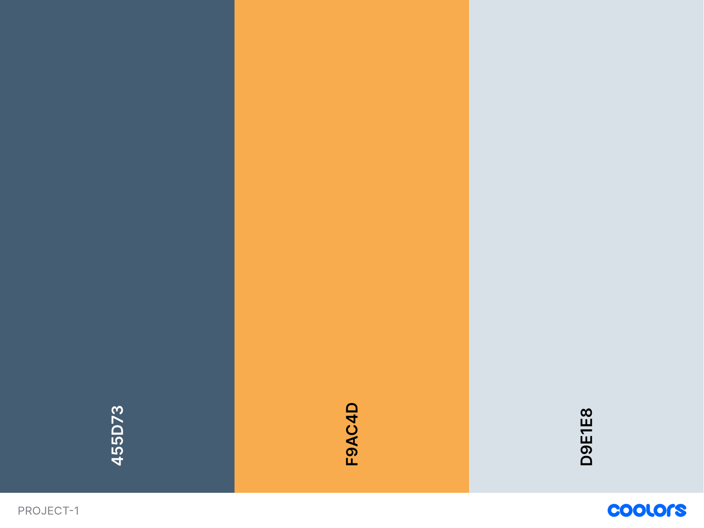
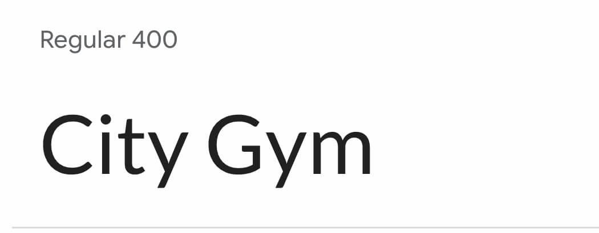
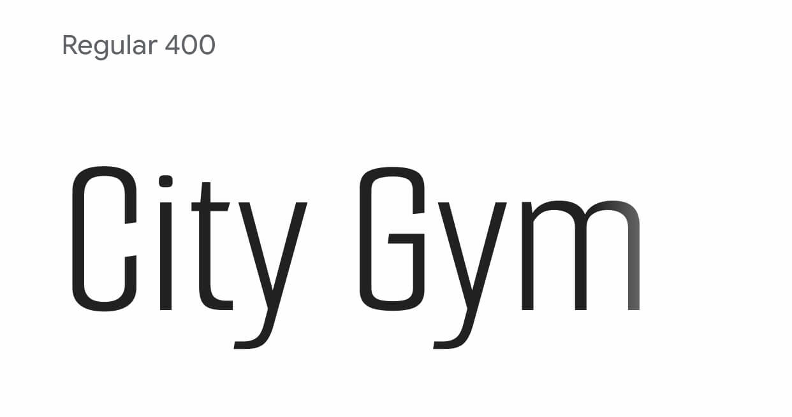
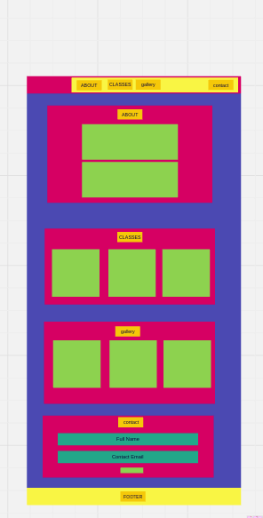

# Introduction

# City Gym

The City Gym website is designed for users to easily navigate the website. It allows existing members and potential new members to find all the information they need.
  
The link to City Gym website can found here: https://mariebernf.github.io/Milestone-Project/

# User Experience

# Design
Color Scheme:

* Paynes Gray is a rich color that conveys strenth and stability. It is ideal for a gym where focus and determination are needed. 
* Orange web is vibrant and encourges action, it grabs the users attention.
* Alice Blue is soft and calming that provides a good contrast to the darker gray and bold orange.
  
These three colors work well together to provide a visually applealing website. The website remains user-friendly and professional.

Typography:

* For the font of the body, Lato font was used. Lato is good choice for the main text in a webpage because it is easy to read and looks professional.

* For the logo Smooch sans font was used. Smooch sans is easy to read and looks friendly.
  
* The combination of both fonts used on the website ensures that it is both user-friendly and engaging. 

  

# Wireframes

* The final design has evolved in different ways to improve user experience.
  
# Deployment

# Technologies used

# Testing

# Bugs

# Credits

# Acknowledgments

