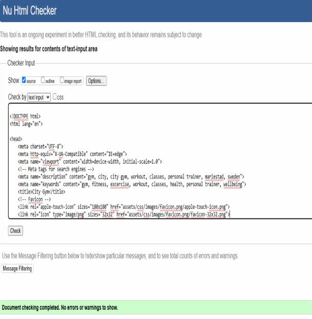
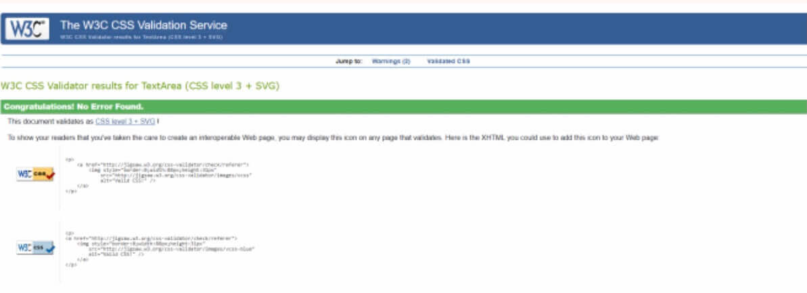

# Introduction

# City Gym

The City Gym website is designed for users to easily navigate the website. It allows existing members and potential new members to find all the information they need.
  
The link to City Gym website can found here: https://mariebernf.github.io/Milestone-Project/

# User Experience
User stories:
* As a new user and potential member. I want to be able to navigate the website and find information easily.
* As a new user and potential member. I want to see what the gym as to offer.
* As an existing member. I want to see what classes are available, so I can plan my fitness routine.
* As an existing member. I want to see the dates and times of classes available, so I can plan my schedule.
* As a new user and existing member. I want to see the benifits of membership.

Website Aims:
* To create a user friendly site where users can navigate easily and find out the information they need. This will be done with an easy to use navigation bar. With links to sections such as classes, gallery and contact.
* To create a contact form for users if they need additional information.
* To highlight what classes are available.
* To let users know the benefits of membership, such as classes are free to members.

# Design
Color Scheme:

* Paynes Gray is a rich color that conveys strenth and stability. It is ideal for a gym where focus and determination are needed. 
* Orange web is vibrant and encourges action, it grabs the users attention.
* Alice Blue is soft and calming that provides a good contrast to the darker gray and bold orange.
  
These three colors work well together to provide a visually applealing website. The website remains user-friendly and professional.

Typography:

* For the font of the body, Lato font was used. Lato is good choice for the main text in a webpage because it is easy to read and looks professional.

* For the logo Smooch sans font was used. Smooch sans is easy to read and looks friendly.
  
* The combination of both fonts used on the website ensures that it is both user-friendly and engaging. 

  

# Wireframes

* The final design has evolved in different ways to improve user experience.
  
# Deployment
## Deployment steps: 
1. Go to the settings tab in your Github repository.
2. Select pages in the code and automation section.
3. Ensure the source is set to "Deploy from branch".
4. This can take a few minutes.
5. Gitpages will now show Active deployments.

# Technologies used

* HTML was used for the structure and content of the website.

* CSS was used for the styling of the website.

* CSS flexbox was used to arrange content.

* TinyPNG was used to compress images.

* Gitpod was used to develop the website.

* GitBash was the terminal used to push changes to the GitHub repository.

* Github was used to host and deploy the website.

# Testing

Manual testing:

Navbar:
* Home link - When the user clicks on the home link, they are taken to the home section. **Tested and Passed.**
* Classes link - When the user clicks on the classes link, they are taken to the classes section. **Tested and Passed.**
* Gallery link - When the user clicks on the gallery link, they are taken to the gallery section. **Tested and Passed.**
* Contact link - When the user clicks on the contact link, they are taken to the contact section. **Tested and Passed.**

Contact form:
* Full name input - User enters name. If the user does not enter their name an error message appears. **Tested and Passed.**
* Email input - User enters their email address. If the user does not enter their email address an error message appears. **Tested and Passed.**
* Submit button - User clicks on the submit button. The user is redirected to "formdump.codeinstitute.net" in a new tab. **Tested and Passed.**

Footer:
* Facebook icon - User clicks the icon. The user is taken to the Facebook page in a new tab. **Tested and Passed.**
* Twitter icon - User clicks the icon. The user is taken to the Twitter page in a new tab. **Tested and Passed.**
* YouTube icon - User clicks the icon. The user is taken to the YouTube page in a new tab. **Tested and Passed.**
* Instagram icon - User clicks the icon. The user is taken to the Instagram page in a new tab. **Tested and Passed.**

Validator testing:

* HTML Tested by W3C validator:
  
  

* CSS Tested by W3C (Jigsaw) validator:

* Lighthouse

# Bugs

# Credits

# Acknowledgments

